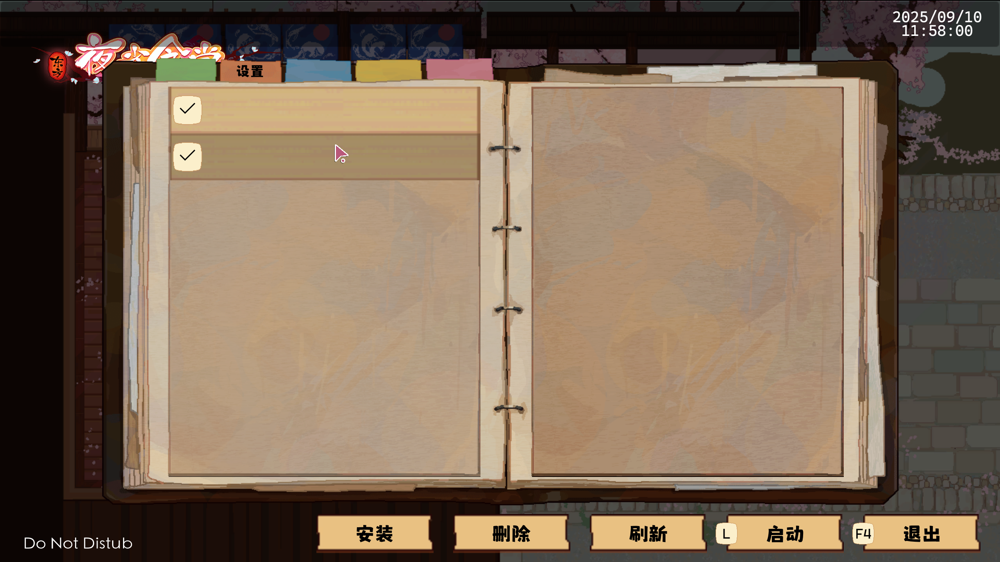
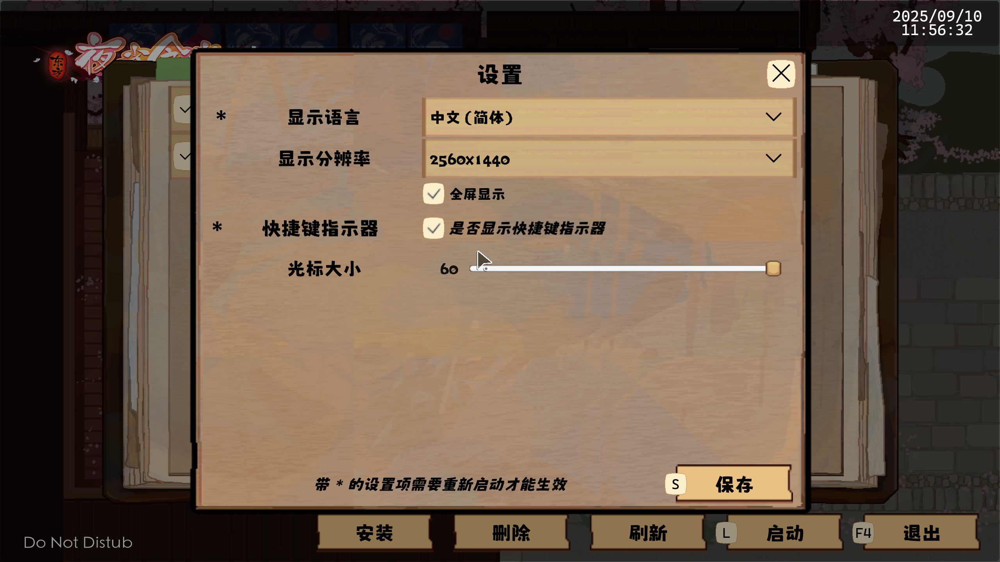
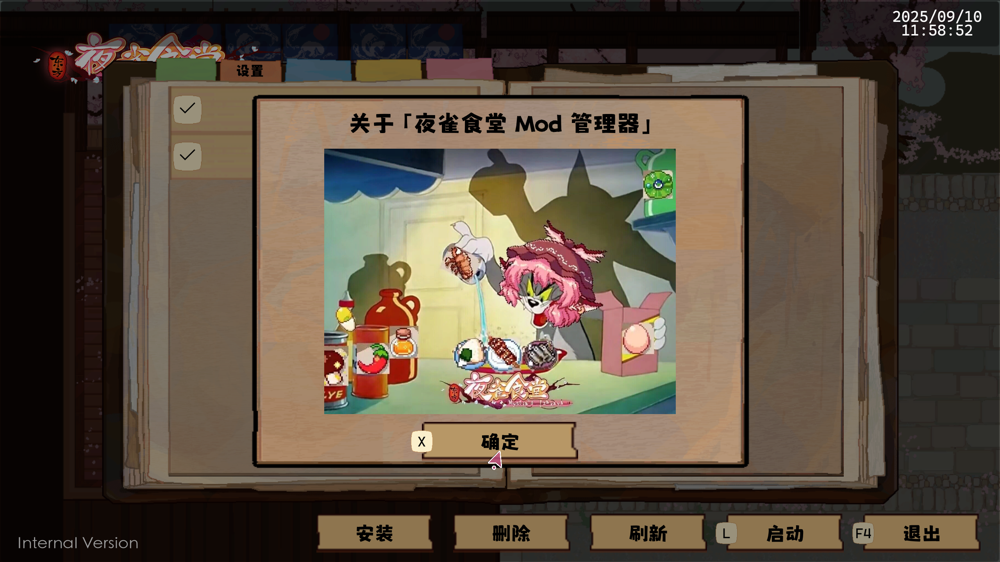

# <ruby title="You Know Too Much">Tou<rt>T</rt>hou<rt>H</rt> Mystia<rt>M</rt> Izakaya<rt>I</rt></ruby> Mod Manager
<font size=75%><del>Also known as TMI, THMI is the official name</del></font>


<!--  -->
<!--  -->
<!--  -->
[English](README_en.md)<sub>\(Current File\)</sub> | [Simplified Chinese](README.md) | [Japanese](READEME_ja.md)

**This Project using GNU GPL 3 License**

## Project Introduction

TMI Mod Manager is a tool for managing and organizing mods for Night Sparrow Canteen. It aims to provide users with a simple interface to easily add, remove, and manage mods in the game.
If you have any suggestions or ideas, please join the QQ group: 470175141

<details>
<summary>⭐Click here⭐ to view⭐ beautiful⭐ promotional materials⭐</summary>

! Introducing! The only known gathering place for discussion on the Bird Food mod.
[470175141](https://qm.qq.com/q/ZjHPtumekw) [470175141](https://qm.qq.com/q/ZjHPtumekw) [470175141](https://qm.qq.com/q/ZjHPtumekw) (Important things, say it three times)
Whether you're a programmer, artist, musician, planner (is that even necessary?), or just an average player looking to learn and exchange ideas, or just want to see the beauty of the Bird Food mod, join this group chat!


</details>

> [!IMPORTANT]
> **Disclaimer**
>
> **Note**: This project is unofficial and not affiliated with the original development team. We strive to provide users with a convenient mod management tool, but please be aware that using this project may carry certain risks. Please read the relevant documentation carefully before use, and use this project at your own risk.

> [!TIP]
> This project will serve as a demonstration project for Mod Manager.

## Features

> [!NOTE]
> The following features are still under development and may change or even be removed.
>
> Please refer to the latest released version for accuracy.

- [x] **Mod Management**: Easily add, delete, and update mods.
- [x] **Multi-language Support**: Supports Chinese, English, Japanese, and other languages. If you don't have the file you need, you can translate it manually.
- [x] **Window Title Modification**: Automatically modify window titles for easier identification.
- [x] **Speak UI Text**: When you right click the the text, you will hear the sound of this text.
- [ ] **User-Friendly Interface**: Simple and intuitive user interface for easy operation.
- [ ] **Compatibility Check**: Automatically check compatibility between mods to avoid conflicts.
- [ ] **Xbox Controller Support**: Use an Xbox controller to control the entire user interface.
- [ ] Other features are under discussion...

## File Structure

- [**Assets**](Assets): Stores project resource files.
- [**Packages**](Packages): Contains project dependency packages.
- [**ProjectSettings**](ProjectSettings): Project configuration files.

## INI Configuration File Structure
<font size=125%>`AppConfig.ini`:</font>
- ***\[Config\]***: Basic Configuration
- ***\[Localization\]***: Localization Configuration
- ***\[Title\]***: Display Title

## Environment Requirements

- **Unity Version**: 2021.3.28f1
- **Build Type**: Mono
- **Architecture**: x64

## Build and Run

1. Clone the repository locally:

```bash
git clone https://github.com/GlassesMita/TMI-Mod-Manager.git
```

2. Open Unity Hub and add the project:
- Click the "Add" button and select the cloned project folder.
3. Open the project and run it:
- Open the project in the Unity editor and click "File" → "Build Settings"
- Click the ▼ icon to the right of "Build" and select "Clean Build"
- Select the build output folder; we recommend *SteamLibrary/SteamApps/Common/Touhou Mystia Izakaya/Mod Manager*
- After the build is complete, copy the **AppConfig.ini** file from the cloned repository to the same directory as TMI Mod Manager.exe.
- Run TMI Mod Manager.exe.

## Project Example



